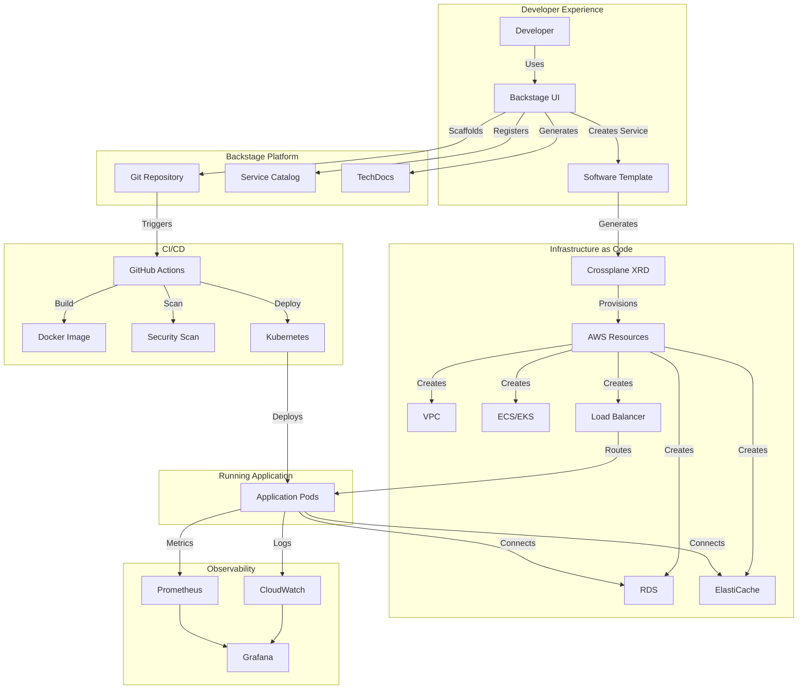
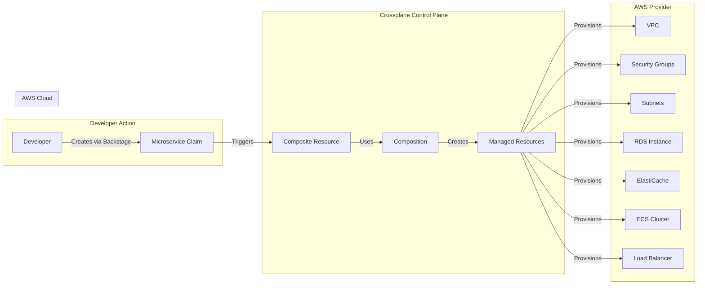
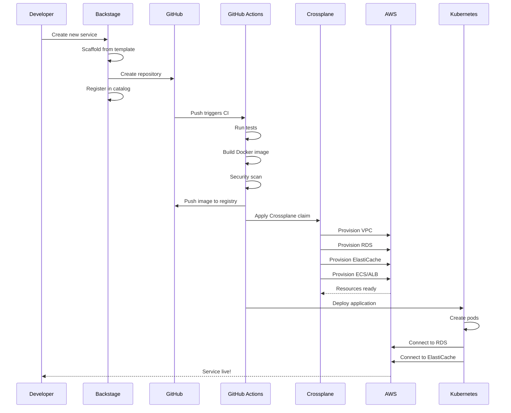
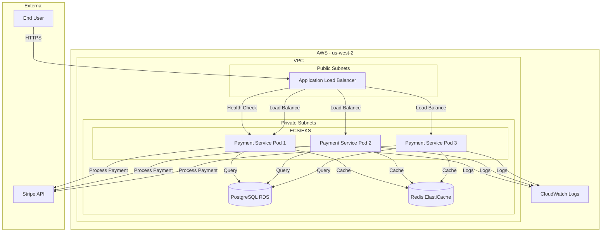
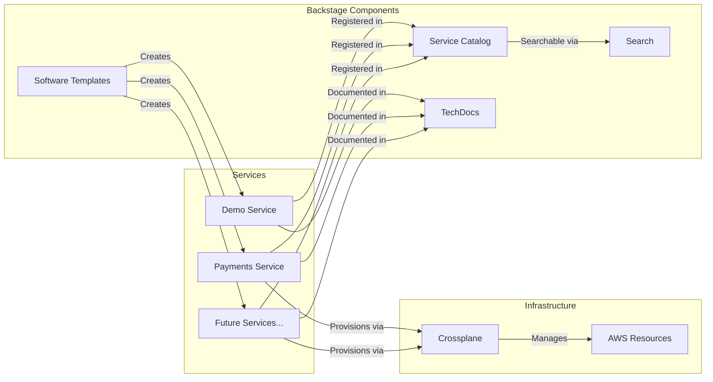
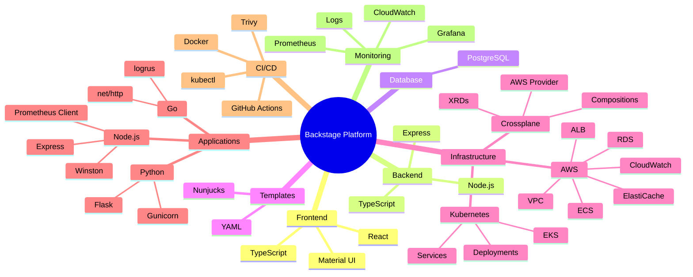

# Backstage Platform Architecture

This document describes the architecture of the Backstage platform with Crossplane integration.

## High-Level Architecture

## Crossplane Resource Flow

## Service Creation Flow

## Payment Service Architecture

## Component Relationships

## Technology Stack

## Architecture Components

### 1. Developer Experience Layer

**Backstage UI**
- Single entry point for developers
- Service catalog browsing
- Template-based service creation
- Documentation access
- Search functionality

**Software Templates**
- Pre-configured project templates
- Parameterized scaffolding
- Automatic catalog registration
- Documentation generation

### 2. Backstage Platform Layer

**Service Catalog**
- Centralized service registry
- Metadata management
- Relationship tracking
- Ownership information

**TechDocs**
- Co-located documentation
- Markdown-based
- Version-controlled
- Auto-generated sites

**Search**
- Full-text search
- Catalog search
- Documentation search
- Filtering and faceting

### 3. CI/CD Layer

**GitHub Actions**
- Automated testing
- Docker image building
- Security scanning
- Deployment automation

**Docker**
- Containerization
- Multi-stage builds
- Image optimization
- Registry management

**Security Scanning**
- Trivy vulnerability scanning
- Dependency checking
- Image scanning
- Compliance reporting

### 4. Infrastructure as Code Layer

**Crossplane**
- Kubernetes-native IaC
- Multi-cloud abstraction
- Resource composition
- Drift detection

**AWS Provider**
- EC2 (VPC, Subnets, Security Groups)
- RDS (PostgreSQL)
- ElastiCache (Redis)
- ECS/EKS (Container orchestration)
- ELB (Load balancers)
- CloudWatch (Logging)

### 5. Application Runtime Layer

**Kubernetes**
- Pod orchestration
- Service discovery
- Load balancing
- Auto-scaling
- Health checks

**Application Services**
- Express.js (Node.js)
- Flask (Python)
- net/http (Go)
- Database connections
- Cache connections

### 6. Observability Layer

**Metrics**
- Prometheus collection
- Custom application metrics
- Infrastructure metrics
- Grafana dashboards

**Logging**
- Structured JSON logs
- CloudWatch integration
- Centralized log aggregation
- Log retention policies

**Tracing**
- Distributed tracing (future)
- Request correlation
- Performance analysis

## Data Flow

### Service Creation Flow

1. **Developer initiates** service creation via Backstage UI
2. **Template execution** scaffolds project files
3. **Git repository** created with initial code
4. **Catalog registration** adds service to Backstage catalog
5. **CI pipeline** triggered on repository push
6. **Infrastructure provisioning** via Crossplane claim
7. **Application deployment** to Kubernetes
8. **Service available** and monitored

### Request Flow

1. **User request** arrives at Application Load Balancer
2. **Load balancer** routes to healthy pod
3. **Application pod** processes request
4. **Database queries** executed if needed
5. **Cache lookups** performed for performance
6. **External APIs** called (e.g., Stripe)
7. **Response returned** to user
8. **Metrics logged** for observability

## Security Architecture

### Network Security
- VPC isolation
- Private subnets for workloads
- Security groups for access control
- TLS termination at load balancer

### Application Security
- Non-root containers
- Read-only filesystems
- Secret management
- Security scanning in CI

### Infrastructure Security
- IAM roles and policies
- Least privilege access
- Audit logging
- Encryption at rest and in transit

## Scalability

### Horizontal Scaling
- Kubernetes HPA (Horizontal Pod Autoscaler)
- Auto-scaling based on CPU/memory
- Load balancer distribution
- Multi-AZ deployment

### Vertical Scaling
- Resource limits per environment
- Database instance sizing
- Cache cluster sizing
- Load balancer capacity

## High Availability

### Multi-AZ Deployment
- Pods across availability zones
- Database multi-AZ configuration
- Load balancer across AZs
- Automatic failover

### Health Checks
- Liveness probes
- Readiness probes
- Database connectivity checks
- Cache connectivity checks

## Disaster Recovery

### Backup Strategy
- Database automated backups
- Configuration backups
- State management
- Recovery procedures

### Failover Procedures
- Cross-region replication (future)
- Backup restoration
- Service restoration
- Data consistency checks

## Cost Optimization

### Resource Right-Sizing
- Environment-specific sizing
- Auto-scaling policies
- Reserved instances (future)
- Spot instances (future)

### Monitoring
- Cost tracking
- Resource utilization
- Optimization recommendations
- Budget alerts

## Future Enhancements

### Planned Features
- Multi-cloud support (GCP, Azure)
- Service mesh integration
- Advanced monitoring
- Cost optimization tools
- Policy enforcement
- GitOps integration

### Integration Opportunities
- ArgoCD for GitOps
- Istio/Linkerd for service mesh
- OPA for policy enforcement
- Cost management tools
- Advanced analytics

---

For detailed deployment instructions, see [DEPLOYMENT.md](examples/payments-service/DEPLOYMENT.md)

For Crossplane setup, see [CROSSPLANE_SETUP.md](CROSSPLANE_SETUP.md)

